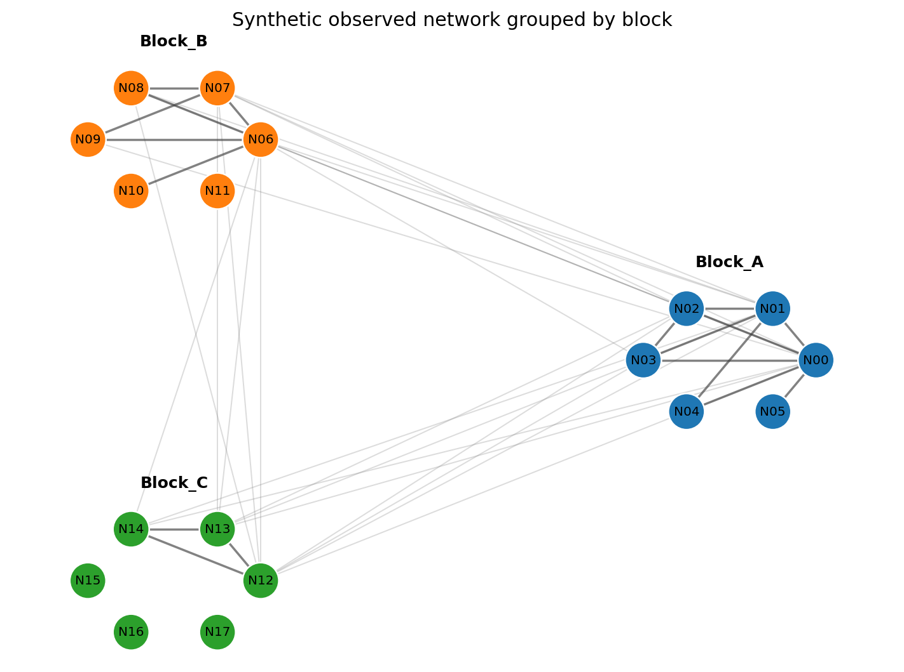
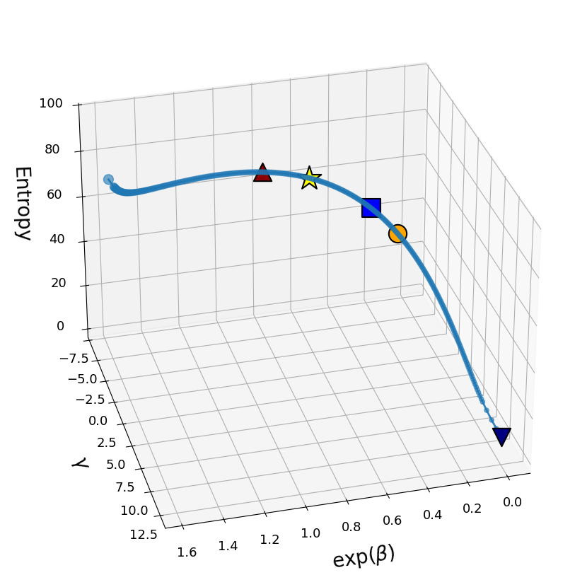
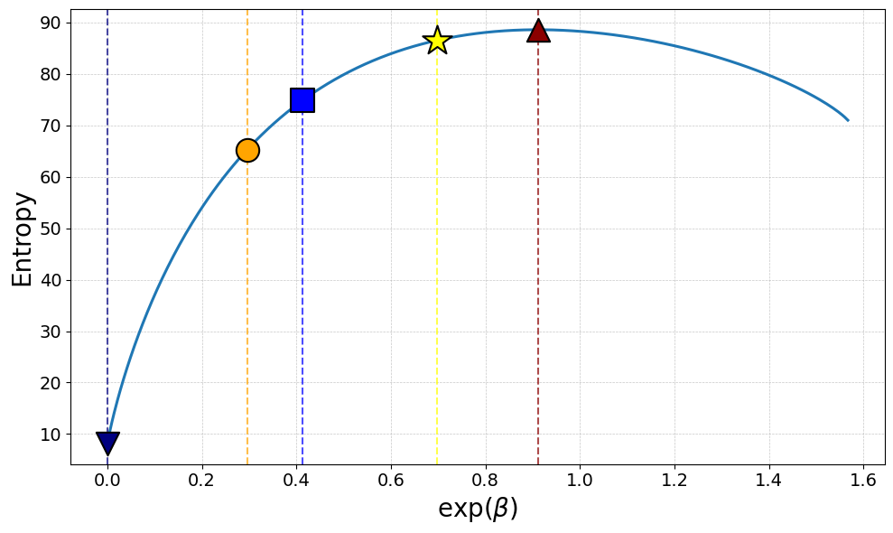
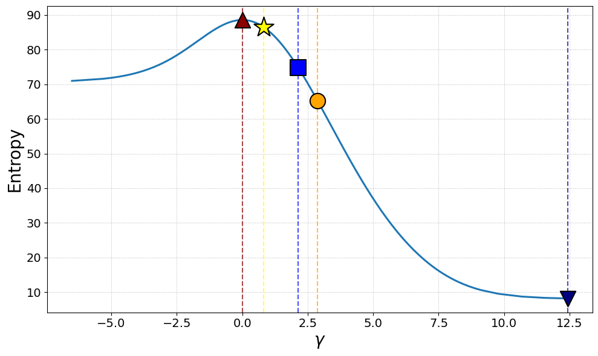
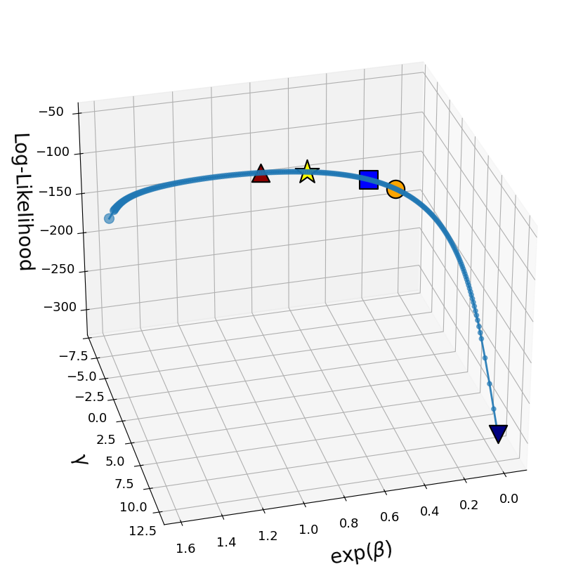
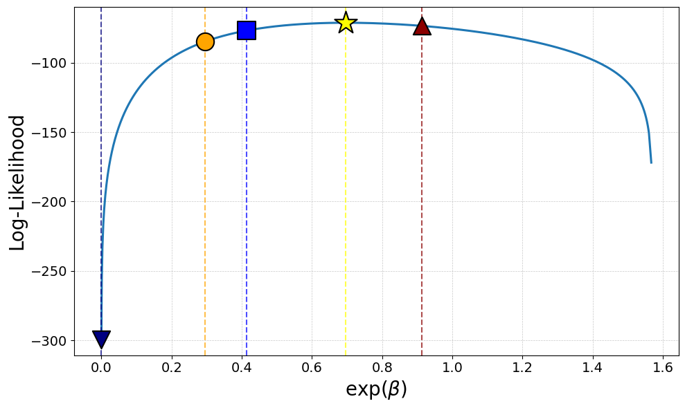
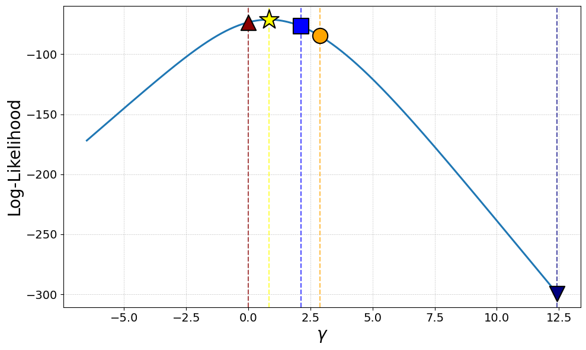

# Network Reconstruction Jeffrey

Reusable Python package for trade-network reconstruction with the Fitness Model,
the Fitness-Corrected Block Model in planted-partition form, and the Jeffreys-prior
feasible-curve method for missing sufficient statistics.

The package provides a low-level synthetic workflow matching
`trade_jeffreys/notebooks/jeffreys_synthetic_usage.ipynb`. The workflow starts
from node fitnesses, block labels, total links, intra-block links, inter-block
links, and an optional observed adjacency matrix. It then computes the
full-information reference parameters, the Jeffreys-prior median-entropy
solution, diagnostics, metrics, and plots.

This package is associated with the research article:

> **Network Reconstruction via Jeffreys Prior under Missing Sufficient Statistics**  
> Minh Duc Duong and Diego Garlaschelli, 2026.  
> Google Scholar record: <https://scholar.google.com/citations?view_op=view_citation&hl=en&user=ps0A1EYAAAAJ&citation_for_view=ps0A1EYAAAAJ:d1gkVwhDpl0C>

The paper studies binary reconstruction of international trade networks when only
node fitnesses, block labels, and the total number of links are available. The core
contribution is a Jeffreys-prior averaging procedure over the one-dimensional
feasible curve defined by the total-link constraint.

## Authors and License
The source code in this repository is released under the BSD 3-Clause License.

The accompanying paper, explanatory text, and documentation are associated with the article
"Network Reconstruction via Jeffreys Prior under Missing Sufficient Statistics" and may be
distributed under CC BY 4.0 where explicitly indicated by the publisher.

Example notebooks are released under the same BSD 3-Clause License as the code unless stated otherwise.

Datasets are not redistributed with this package. Users must obtain the original data from their
respective providers and comply with the corresponding data licenses.

Package authors and copyright holders:

- Minh Duc Duong
- Diego Garlaschelli

 See `LICENSE` and `AUTHORS.md` for the package ownership notice.

## Model parameterization

For node fitness values `x_i`, block labels, and binary relation
`R_ij = 1` when nodes `i` and `j` are in the same block, and `R_ij = 0`
otherwise, the paper's probability

$$
p_{ij}(\beta,\gamma)=
\frac{\exp(\beta)\exp(\gamma R_{ij})x_i x_j}
{1+\exp(\beta)\exp(\gamma R_{ij})x_i x_j}
$$

is represented in code using `g = exp(beta)`:

$$
p_{ij}(g,\gamma)=
\frac{g\exp(\gamma R_{ij})x_i x_j}
{1+g\exp(\gamma R_{ij})x_i x_j},
\qquad g=\exp(\beta).
$$

The feasible curve used by the Jeffreys-prior averaging procedure is defined by
the single total-link constraint:

$$
C(g,\gamma)\equiv \sum_{i<j}p_{ij}(g,\gamma)-L_{\mathrm{total}}=0.
$$

This wording is deliberate: the curve is the **feasible curve** induced by the
observed `L_total`; the Jeffreys prior is then computed along this curve.

The package can also compute a full-information reference point when both
`L_same` and `L_diff` are available.

## Repository layout

The current repository layout is:

```text
.
├── trade_jeffreys/
│   ├── notebooks/
│   │   └── jeffreys_synthetic_usage.ipynb
│   ├── __init__.py
│   ├── data_loading.py
│   ├── jeffreys.py
│   ├── pipeline.py
│   ├── plotting.py
│   ├── regions.py
│   ├── two_param.py
│   ├── validation.py
│   ├── visualisation.py
│   └── workflow.py
├── .gitignore
├── AUTHORS.md
├── CITATION.cff
├── LICENSE
├── MANIFEST.in
├── README.md
└── pyproject.toml
```

Main modules:

| path | purpose |
|---|---|
| `trade_jeffreys/regions.py` | region map and plotting colors |
| `trade_jeffreys/data_loading.py` | data-loading helpers |
| `trade_jeffreys/pipeline.py` | pipeline utilities for node tables and adjacency matrices |
| `trade_jeffreys/two_param.py` | two-constraint planted-partition fit and metrics |
| `trade_jeffreys/jeffreys.py` | Jeffreys feasible-curve scan, resampling, and highlights |
| `trade_jeffreys/plotting.py` | generic 2D and 3D curve plotting |
| `trade_jeffreys/visualisation.py` | network and fitness-vs-degree plotting |
| `trade_jeffreys/validation.py` | edge-data construction, checks, ROC/PR/AIC/BIC |
| `trade_jeffreys/workflow.py` | workflow-level orchestration helpers |
| `trade_jeffreys/notebooks/jeffreys_synthetic_usage.ipynb` | complete synthetic usage notebook |

## Installation / import

For local use, place the repository root on your Python path or install the
package in editable mode from the project root:

```bash
pip install -e .
```

Core dependencies:

```text
numpy
pandas
matplotlib
networkx
scikit-learn
scipy
```

For notebooks stored inside `trade_jeffreys/notebooks/`, the first cell can add
the project root to `sys.path` automatically.

## Synthetic workflow

The paper-level algorithm can be run manually from network-level inputs:

```python
from trade_jeffreys import (
    fit_true_params_from_link_counts,
    run_jeffreys_pipeline,
    compute_metrics_true_and_median,
    plot_curve_2d,
    plot_curve_3d,
)
```

The low-level inputs are:

- `country_df`: one row per node, with at least `fitness` and `region` columns;
- `L_total`: observed total number of links;
- `L_same`: observed number of intra-block links, used only for the
  full-information reference fit;
- `L_diff`: observed number of inter-block links, used only for the
  full-information reference fit;
- `adj_matrix`: optional binary adjacency matrix, required for ROC/PR and
  log-likelihood metrics.

## Input data contract for the synthetic workflow

The core functions expect a node-level `pandas.DataFrame` with at least these
columns:

| column | meaning |
|---|---|
| `ISO3` | node identifier; any unique string is acceptable |
| `region` | block/community/group label |
| `fitness` | positive node fitness value |

The optional adjacency matrix should be a square symmetric binary matrix with the
same node order as `df_raw["ISO3"]`. It is required only for likelihood-based
metrics such as ROC AUC, PR AUC, AIC, and BIC.

## Minimal synthetic usage

```python
from pathlib import Path
import sys

# Optional helper for notebooks: locate the local package when running from
# either the project root or a notebooks/ folder.
cwd = Path.cwd().resolve()
for candidate in [cwd, cwd.parent, cwd.parent.parent, cwd.parent.parent.parent]:
    if (candidate / "trade_jeffreys" / "__init__.py").exists():
        sys.path.insert(0, str(candidate))
        print(f"Using project root: {candidate}")
        break
else:
    raise RuntimeError("Could not locate the trade_jeffreys package folder.")
```

```python
import numpy as np
import pandas as pd

from trade_jeffreys import (
    fit_true_params_from_link_counts,
    run_jeffreys_pipeline,
    compute_metrics_true_and_median,
    plot_curve_2d,
    plot_curve_3d,
)
```

### 1. Define network-level inputs

```python
node_ids = [f"N{i:02d}" for i in range(18)]
block_labels = (
    ["Block_A"] * 6 +
    ["Block_B"] * 6 +
    ["Block_C"] * 6
)

fitness = np.array([
    1.55, 1.40, 1.20, 1.05, 0.90, 0.75,
    1.45, 1.30, 1.10, 0.95, 0.80, 0.65,
    1.35, 1.15, 1.00, 0.85, 0.70, 0.55,
])
fitness = fitness / fitness.max()

country_df = pd.DataFrame({
    "ISO3": node_ids,
    "region": block_labels,
    "fitness": fitness,
})

# Observed sufficient statistics for the full-information reference model.
# The Jeffreys-prior method below uses only L_total.
L_same = 18
L_diff = 25
L_total = L_same + L_diff
```

Example node table:

| ISO3 | region | fitness |
|---|---|---:|
| N00 | Block_A | 1.000000 |
| N01 | Block_A | 0.903226 |
| N02 | Block_A | 0.774194 |
| N03 | Block_A | 0.677419 |
| N04 | Block_A | 0.580645 |

### 2. Provide or construct an adjacency matrix

In a real application, use the observed binary network. For a synthetic example,
construct a deterministic matrix with the requested same-block and different-block
link counts:

```python
def build_adjacency_from_counts(country_df, L_same, L_diff, seed=7):
    """Construct a symmetric binary adjacency matrix with exact block counts."""
    rng = np.random.default_rng(seed)
    x = country_df["fitness"].to_numpy(float)
    labels = country_df["region"].astype(str).to_numpy()
    n = len(country_df)

    same_pairs = []
    diff_pairs = []
    for i in range(n):
        for j in range(i + 1, n):
            same = labels[i] == labels[j]
            # Fitness-based score plus tiny random jitter to break ties.
            score = x[i] * x[j] * (1.35 if same else 1.0) + 1e-6 * rng.normal()
            if same:
                same_pairs.append((score, i, j))
            else:
                diff_pairs.append((score, i, j))

    if L_same > len(same_pairs):
        raise ValueError("L_same exceeds the number of same-block pairs.")
    if L_diff > len(diff_pairs):
        raise ValueError("L_diff exceeds the number of different-block pairs.")

    A = np.zeros((n, n), dtype=int)
    for _, i, j in sorted(same_pairs, reverse=True)[:L_same]:
        A[i, j] = A[j, i] = 1
    for _, i, j in sorted(diff_pairs, reverse=True)[:L_diff]:
        A[i, j] = A[j, i] = 1

    return pd.DataFrame(A, index=country_df["ISO3"], columns=country_df["ISO3"])

adj_matrix = build_adjacency_from_counts(country_df, L_same, L_diff)
```

Count check from the synthetic example:

| quantity | target | observed_in_adj_matrix |
|---|---:|---:|
| `L_same` | 18 | 18 |
| `L_diff` | 25 | 25 |
| `L_total` | 43 | 43 |


### 2.1 Plot the observed network by block

The synthetic example can also visualize the observed binary network before
running the reconstruction models. Nodes are grouped and colored by their block
labels, while same-block and different-block links are drawn with different
edge intensities.

```python
import networkx as nx
import matplotlib.pyplot as plt

def plot_network_by_block(adj_matrix, country_df, block_col="region", node_col="ISO3"):
    labels = country_df[node_col].astype(str).to_list()
    blocks = country_df[block_col].astype(str).to_numpy()

    G = nx.from_pandas_adjacency(adj_matrix.astype(int))
    G = nx.relabel_nodes(G, {node: str(node) for node in G.nodes()})

    unique_blocks = list(pd.unique(blocks))
    block_to_nodes = {
        block: country_df.loc[country_df[block_col].astype(str) == block, node_col].astype(str).to_list()
        for block in unique_blocks
    }

    angles = np.linspace(0, 2 * np.pi, len(unique_blocks), endpoint=False)
    centers = {
        block: np.array([3.0 * np.cos(angle), 3.0 * np.sin(angle)])
        for block, angle in zip(unique_blocks, angles)
    }

    pos = {}
    for block, nodes in block_to_nodes.items():
        local_angles = np.linspace(0, 2 * np.pi, len(nodes), endpoint=False)
        radius = 0.70 if len(nodes) > 1 else 0.0
        for node, angle in zip(nodes, local_angles):
            pos[node] = centers[block] + radius * np.array([np.cos(angle), np.sin(angle)])

    color_map = {block: f"C{i}" for i, block in enumerate(unique_blocks)}
    node_to_block = dict(zip(labels, blocks))

    node_colors = [color_map[node_to_block[str(node)]] for node in G.nodes()]
    same_edges = [(u, v) for u, v in G.edges() if node_to_block[str(u)] == node_to_block[str(v)]]
    diff_edges = [(u, v) for u, v in G.edges() if node_to_block[str(u)] != node_to_block[str(v)]]

    fig, ax = plt.subplots(figsize=(8, 6))
    nx.draw_networkx_edges(G, pos, edgelist=diff_edges, width=0.8, alpha=0.30, edge_color="0.55", ax=ax)
    nx.draw_networkx_edges(G, pos, edgelist=same_edges, width=1.4, alpha=0.65, edge_color="0.25", ax=ax)
    nx.draw_networkx_nodes(G, pos, node_color=node_colors, node_size=520, linewidths=1.0, edgecolors="white", ax=ax)
    nx.draw_networkx_labels(G, pos, font_size=8, font_color="black", ax=ax)

    for block, center in centers.items():
        ax.text(center[0], center[1] + 1.15, block, ha="center", va="center", fontsize=10, fontweight="bold")

    ax.set_title("Synthetic observed network grouped by block")
    ax.set_axis_off()
    fig.tight_layout()
    return fig, ax

plot_network_by_block(adj_matrix, country_df)
```



### 3. Fit the full-information planted-partition reference

This reference uses both `L_same` and `L_diff` and corresponds to the paper's
full-information planted-partition point.

```python
true_fit = fit_true_params_from_link_counts(
    df_raw=country_df,
    L_same_obs=L_same,
    L_diff_obs=L_diff,
    adj_matrix=adj_matrix,
)

true_summary = pd.DataFrame([{
    "beta": true_fit["beta"],
    "g = exp(beta)": true_fit["g"],
    "gamma": true_fit["gamma"],
    "entropy": true_fit["entropy"],
    "loglik": true_fit["loglik"],
    "pred_links": true_fit["pred_links"],
}])
```

Example output:

| beta | g = exp(beta) | gamma | entropy | loglik | pred_links |
|---:|---:|---:|---:|---:|---:|
| -0.361228 | 0.696820 | 0.820880 | 86.502928 | -71.220090 | 43 |

### 4. Run the Jeffreys-prior pipeline using only `L_total`

The estimation step below intentionally hides `L_same` and `L_diff` from the
Jeffreys-prior pipeline. The full-information fit is passed only as a highlight
point for comparison.

```python
true_params = {k: true_fit[k] for k in ("g", "gamma", "entropy", "loglik")}

grid = np.linspace(1e-4, 4.0, 800)

jeffreys = run_jeffreys_pipeline(
    df_raw=country_df,
    total_links=L_total,
    g_range=grid,
    true_params=true_params,
    resample_points=250,
    max_link_error=1e-6,
    adj_matrix=adj_matrix,
)

curve = jeffreys["df_s_uniform_exact"]
highlights = jeffreys["highlights"]
```

The `curve` table contains sampled feasible-curve points, including `beta`,
`g`, `gamma`, predicted links, entropy, log-likelihood, and Jeffreys weights.

### 5. Inspect highlight points

```python
highlight_table = pd.DataFrame(highlights)
highlight_table["beta"] = np.log(highlight_table["g"].astype(float))
highlight_table[["label", "beta", "g", "gamma", "entropy", "loglik"]]
```

Example output:

| label | beta | g | gamma | entropy | loglik |
|---|---:|---:|---:|---:|---:|
| Min Entropy | -8.416373 | 0.000221 | 12.430412 | 8.172050 | -299.298000 |
| Max Entropy | -0.091780 | 0.912306 | -0.002603 | 88.585500 | -73.461200 |
| Mean Entropy | -1.218120 | 0.295786 | 2.875220 | 65.256600 | -84.728600 |
| Median Entropy | -0.882304 | 0.413828 | 2.129810 | 74.908100 | -76.856200 |
| True Params | -0.361228 | 0.696820 | 0.820880 | 86.502900 | -71.220100 |

### 6. Compute metrics at true parameters and median entropy

For AIC/BIC, the synthetic notebook follows the paper's convention: the
full-information reference uses two fitted parameters, while the Jeffreys
median-entropy solution has one effective degree of freedom under the total-link
constraint.

```python
metrics = compute_metrics_true_and_median(
    df_raw=country_df,
    adj_matrix=adj_matrix,
    df_uniform=curve,
    highlights=highlights,
    k_true=2,
    k_median=1,
    aicbic_mode="full_symmetric",
)

metrics_table = pd.DataFrame(metrics).T
metrics_table[["g", "gamma", "roc_auc", "pr_auc", "AIC", "BIC", "pred_links"]]
```

Example output:

| solution | g | gamma | roc_auc | pr_auc | AIC | BIC | pred_links |
|---|---:|---:|---:|---:|---:|---:|---:|
| True Params | 0.696820 | 0.820880 | 0.913742 | 0.801724 | 288.881 | 296.328 | 43 |
| Median Entropy | 0.413828 | 2.129810 | 0.857294 | 0.725047 | 309.425 | 313.148 | 43 |

## Plotting

The plotting helpers reproduce the same diagnostic curves as the example
notebook.

```python
plot_curve_3d(
    curve,
    z_column="entropy",
    z_label="Entropy",
    highlight_points=highlights,
)
```



```python
plot_curve_2d(
    curve,
    x_column="g",
    y_column="entropy",
    x_label=r"exp($\beta$)",
    y_label="Entropy",
    highlight_points=highlights,
)
```



```python
plot_curve_2d(
    curve,
    x_column="gamma",
    y_column="entropy",
    x_label=r"$\gamma$",
    y_label="Entropy",
    sort_within="gamma",
    highlight_points=highlights,
)
```



The same curve can be plotted on the log-likelihood scale:

```python
plot_curve_3d(
    curve,
    z_column="loglik",
    z_label="Log-Likelihood",
    highlight_points=highlights,
)
```



```python
plot_curve_2d(
    curve,
    x_column="g",
    y_column="loglik",
    x_label=r"exp($\beta$)",
    y_label="Log-Likelihood",
    highlight_points=highlights,
)
```



```python
plot_curve_2d(
    curve,
    x_column="gamma",
    y_column="loglik",
    x_label=r"$\gamma$",
    y_label="Log-Likelihood",
    sort_within="gamma",
    highlight_points=highlights,
)
```



## Outputs

The synthetic workflow produces these main objects:

| object | content |
|---|---|
| `country_df` | one row per node: identifier, block label, and fitness |
| `adj_matrix` | binary adjacency DataFrame indexed by node identifier |
| `true_fit` | full-information planted-partition fit from `L_same` and `L_diff` |
| `jeffreys` | Jeffreys feasible-curve output dictionary |
| `curve` | sampled feasible-curve table, usually `jeffreys["df_s_uniform_exact"]` |
| `highlights` | highlight points: min/max/mean/median entropy plus optional true parameters |
| `highlight_table` | tabular form of the highlight points |
| `metrics` | ROC/PR/AIC/BIC comparison at True Params and Median Entropy |
| `metrics_table` | tabular form of `metrics` |

## Function overview

| function | purpose |
|---|---|
| `fit_true_params_from_link_counts` | fits the two-parameter full-information planted-partition reference from `L_same` and `L_diff` |
| `run_jeffreys_pipeline` | builds the feasible curve from `L_total`, computes Jeffreys-weighted points, and returns highlight solutions |
| `compute_metrics_true_and_median` | compares true/full-information parameters with the Jeffreys median-entropy solution |
| `plot_curve_2d` | plots entropy or log-likelihood against `g` or `gamma` |
| `plot_curve_3d` | plots the 3D feasible curve with selected highlight points |

## Complete notebook

For a fully executable version of the synthetic guide, open:

```text
trade_jeffreys/notebooks/jeffreys_synthetic_usage.ipynb
```

The notebook contains the complete synthetic data construction, exact link-count
verification, model fitting, Jeffreys-prior curve estimation, metric computation,
figures, and optional CSV export.

## Citation

If this package is used in academic work, cite the article above and mention that
the implementation is the companion `trade_jeffreys` package by Minh Duc Duong
and Diego Garlaschelli.
